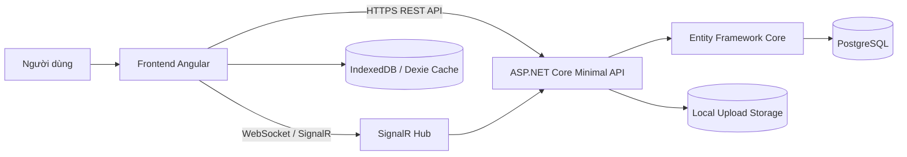
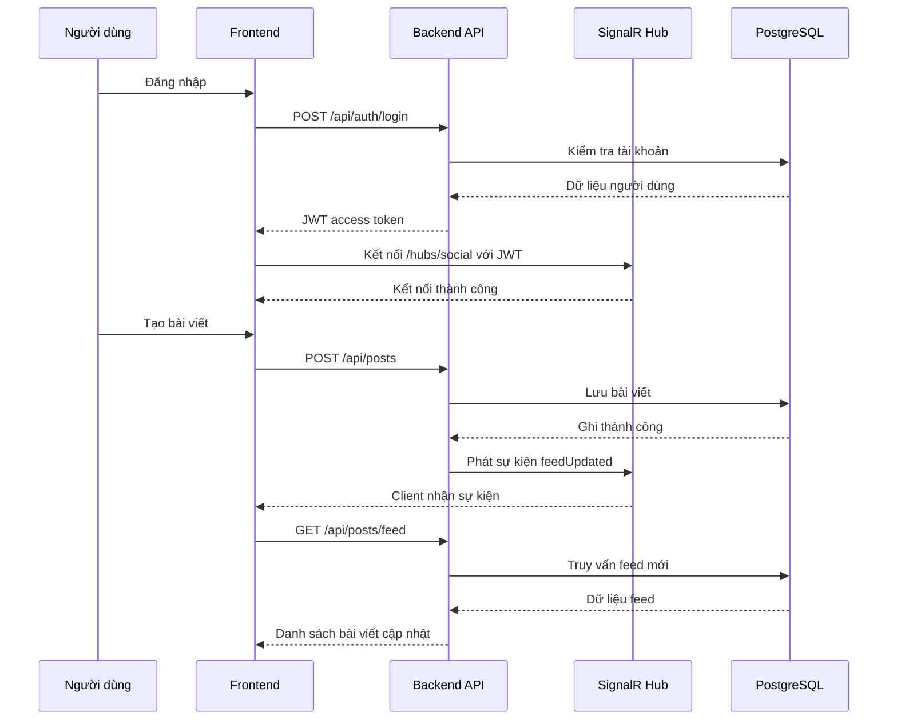

# TÀI LIỆU THIẾT KẾ HỆ THỐNG

## 1. Mục tiêu tài liệu

Tài liệu này mô tả thiết kế hệ thống của dự án Social Blog, bao gồm phạm vi chức năng, các thành phần chính, luồng xử lý, nguyên tắc triển khai và định hướng kiến trúc nhằm đáp ứng yêu cầu chịu tải tốt và có khả năng mở rộng theo chiều ngang.

Mục tiêu của hệ thống là cung cấp một nền tảng mạng xã hội/blog thu gọn với các chức năng cốt lõi: xác thực người dùng, quản lý quan hệ bạn bè, tạo bài viết, tương tác thời gian thực, bình luận, thích bài viết và tải ảnh lên hệ thống.

## 2. Phạm vi chức năng hiện tại

### 2.1 Frontend
- Đăng ký tài khoản, đăng nhập
- Hiển thị trang feed
- Tìm kiếm người dùng
- Gửi và chấp nhận lời mời kết bạn
- Xem hồ sơ cá nhân
- Tạo bài viết văn bản và đính kèm ảnh
- Nhận cập nhật thời gian thực qua SignalR
- Lưu cache feed cục bộ bằng IndexedDB (Dexie)

### 2.2 Backend
- Cung cấp REST API cho xác thực, hồ sơ người dùng, bạn bè, bài viết, bình luận và lượt thích
- Cung cấp SignalR Hub cho sự kiện thời gian thực
- Xác thực bằng JWT
- Lưu trữ dữ liệu bằng PostgreSQL thông qua Entity Framework Core
- Lưu file ảnh cục bộ qua static file serving

## 3. Công nghệ sử dụng

### 3.1 Frontend
- Angular
- TypeScript
- NgRx
- RxJS
- Dexie / IndexedDB
- SignalR client

### 3.2 Backend
- ASP.NET Core Minimal API
- .NET
- SignalR
- Entity Framework Core
- PostgreSQL
- JWT Bearer Authentication
- BCrypt cho băm mật khẩu

### 3.3 Hạ tầng dữ liệu và triển khai
- PostgreSQL làm cơ sở dữ liệu chính
- Local file storage cho ảnh ở giai đoạn hiện tại
- Docker Compose cho môi trường phát triển

## 4. Kiến trúc tổng thể

Hệ thống được thiết kế theo mô hình client-server, trong đó frontend là ứng dụng Angular chạy phía trình duyệt, backend là dịch vụ ASP.NET Core cung cấp REST API và realtime hub, còn PostgreSQL là nơi lưu trữ dữ liệu nghiệp vụ.

### 4.1 Sơ đồ kiến trúc logic

### 4.2 Các lớp chính của hệ thống
1. Lớp trình bày: Angular frontend
2. Lớp dịch vụ ứng dụng: ASP.NET Core API
3. Lớp giao tiếp thời gian thực: SignalR Hub
4. Lớp truy cập dữ liệu: EF Core DbContext
5. Lớp lưu trữ bền vững: PostgreSQL và vùng lưu file ảnh

### 4.3 Đặc điểm kiến trúc hiện tại
- Kiến trúc tách biệt frontend và backend
- Backend tập trung toàn bộ nghiệp vụ trong một service duy nhất
- Giao tiếp dữ liệu theo REST cho tác vụ nghiệp vụ thông thường
- Giao tiếp sự kiện theo SignalR cho cập nhật gần thời gian thực
- Dữ liệu feed được cache ở phía client để cải thiện trải nghiệm

### 4.4 Sơ đồ luồng xử lý chính

## 5. Luồng nghiệp vụ chính

### 5.1 Đăng ký và đăng nhập
Người dùng gửi thông tin đăng ký hoặc đăng nhập từ frontend đến backend. Backend kiểm tra hợp lệ, băm mật khẩu khi đăng ký, đối chiếu mật khẩu khi đăng nhập và phát hành JWT access token. Token này được frontend lưu cục bộ và gửi kèm trong các yêu cầu tiếp theo.

### 5.2 Thiết lập kết nối realtime
Sau khi đăng nhập, frontend thiết lập kết nối tới `/hubs/social` bằng JWT. Backend xác thực kết nối, ánh xạ connection hiện tại vào group dạng `user:{userId}`. Từ đó, hệ thống có thể đẩy sự kiện trực tiếp đến từng người dùng.

### 5.3 Quản lý quan hệ bạn bè
Khi một người dùng gửi lời mời kết bạn, backend tạo bản ghi friendship ở trạng thái `pending`, lưu vào cơ sở dữ liệu, sau đó phát sự kiện `friendRequestReceived` đến người nhận. Khi lời mời được chấp nhận, trạng thái chuyển sang `accepted` và hệ thống phát thêm sự kiện đồng bộ danh sách bạn bè.

### 5.4 Tạo bài viết và phân phối feed
Người dùng tạo bài viết qua API `/api/posts`. Backend lưu bài viết vào cơ sở dữ liệu, xác định danh sách bạn bè đã được chấp nhận, sau đó gửi sự kiện `feedUpdated` tới các người dùng liên quan. Frontend nhận sự kiện và chủ động gọi lại API feed để lấy dữ liệu mới nhất.

### 5.5 Bình luận và lượt thích
Bình luận và lượt thích được ghi nhận qua REST API. Sau khi cập nhật thành công, backend phát sự kiện `postEngagementUpdated` tới tác giả bài viết để client đồng bộ lại trạng thái hiển thị.

## 6. Nguyên tắc thiết kế

### 6.1 Tách biệt dữ liệu và sự kiện
REST API được sử dụng để đọc/ghi dữ liệu nguồn, trong khi SignalR được sử dụng như kênh thông báo sự kiện. Cách tiếp cận này giúp giảm độ phức tạp trong đồng bộ trạng thái và tránh phụ thuộc quá lớn vào push full-state.

### 6.2 Dữ liệu quan hệ là nguồn chân lý
Tất cả dữ liệu nghiệp vụ chính như user, friendship, post, like, comment được quản lý tập trung trong PostgreSQL. Client chỉ giữ cache phục vụ hiệu năng và trải nghiệm, không phải nguồn dữ liệu gốc.

### 6.3 Tối ưu cho khả năng mở rộng từng bước
Thiết kế hiện tại đủ đơn giản để triển khai nhanh, đồng thời vẫn có điểm mở để chuyển sang kiến trúc nhiều node, phân tách dịch vụ và bổ sung hạ tầng phân tán khi tải tăng cao.
